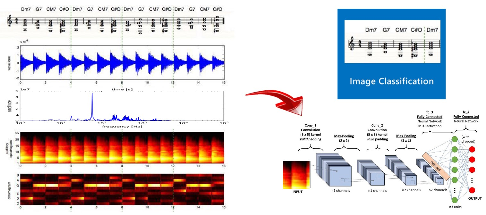

# Audio Analytics with Azure ML and AutoML for Images

Audio processing can consist of extracting audio signal information into spectrograms (time vs frequency vs Db) images that we can use to build a custom vision model with Azure using AutoML for Images. 

We can extract as well some audio features and use a generic classification model with Azure ML and its AutoML capabilities to find the best model.

## Audio Analytics with Azure Presentation 
[Audio Analytics.pdf](https://github.com/retkowsky/Audio_Analytics_With_AzureML/blob/main/Audio%20Analytics.pdf)

## AI Show Audio Analytics demo 

https://aka.ms/AIShow/AudioAnalytics
 
https://youtu.be/iHL9RmOejdo

## Demo: Acoustic Anomaly Detection for Machine Sounds based on Images

### Problem
Is it possible to detect an anomaly (not normal noise) from an equipment or a machine just using a sound file?

### Solution
- We can collect some normal and non-normal (anomaly) sounds files as a training database.
- We can generate spectrograms for all the files for the two categories we want to predict (anomaly / no anomaly).
- We will build and train an image classification model (anomaly / no anomaly) using computer vision algorithms with Azure Custom Vision and Azure AutoML for Images using the spectograms images.
- We can generate audio features and use some usual classification techniques like SVM. We can levarage AutoML Classification features with Azure ML to ensure to find the best model.
- We can deploy the models using these techniques in Azure or on the Edge to test the anomaly detection models we made.

## All the Python notebooks are available here:

- Settings:
[00. Azure ML workspace.ipynb](https://github.com/retkowsky/Audio_Analytics_With_AzureML/blob/main/00.%20Azure%20ML%20workspace.ipynb)  
 
- Downloading and creation of audio samples:
[01. Generating audio samples.ipynb](https://github.com/retkowsky/Audio_Analytics_With_AzureML/blob/main/01.%20Generating%20audio%20samples.ipynb)  
 
- Audio Statistics:
[02. Audio Statistics.ipynb](https://github.com/retkowsky/Audio_Analytics_With_AzureML/blob/main/02.%20Audio%20Statistics.ipynb)  
 
- Audio Analytics:
[03. Audio Analysis.ipynb](https://github.com/retkowsky/Audio_Analytics_With_AzureML/blob/main/03.%20Audio%20Analysis.ipynb)  
 
- Spectograms generation:
[04. Spectograms for CV.ipynb](https://github.com/retkowsky/Audio_Analytics_With_AzureML/blob/main/04.%20Spectograms%20for%20CV.ipynb)  
 
- Calling Azure Custom Vision models:
[05. Calling the Azure Custom Vision model from an audio file spectogram.ipynb](https://github.com/retkowsky/Audio_Analytics_With_AzureML/blob/main/05.%20%20Calling%20the%20Azure%20Custom%20Vision%20model%20from%20an%20audio%20file%20spectogram.ipynb)  
 
- AutoML for Images:
[06. AutoML for Images - Image Classification.ipynb](https://github.com/retkowsky/Audio_Analytics_With_AzureML/blob/main/06.%20AutoML%20for%20Images%20-%20Image%20Classification.ipynb)  
 
- Calling AutoML deployed model:
[07. Calling AutoML CV model.ipynb](https://github.com/retkowsky/Audio_Analytics_With_AzureML/blob/main/07.%20Calling%20AutoML%20CV%20model.ipynb)  

## Azure AutoML
AutoML is an Azure Machine Learning feature, that empowers both professional and citizen data scientists to build machine learning models rapidly. Since its launch, AutoML has helped accelerate model building for essential machine learning tasks like Classification, Regression and Time-series Forecasting.

With the preview of AutoML for Images, there will be added support for Vision tasks. Data scientists will be able to easily generate models trained on image data for scenarios like Image Classification (multi-class, multi-label), Object Detection and Instance Segmentation.

AutoML for Images is currently in Public Preview.

- AutoML for Images documentation: http://aka.ms/AutoMLforImagesDoc
- AutoML for Images Algorithms: http://aka.ms/AutoMLforImagesAlgorithms
- AutoML for Images Tutorial: http://aka.ms/AutoMLforImagesTutorial

### Note
All these Python notebooks were made for demo purposes. They were not designed for production usage. AutoML for Images is currently in public preview. This preview version is provided without a service-level agreement. Certain features might not be supported or might have constrained capabilities. 
For more information, see Supplemental Terms of Use for Microsoft Azure Previews.  
https://azure.microsoft.com/en-us/support/legal/preview-supplemental-terms/

01-Jun-2022
Serge Retkowsky | serge.retkowsky@microsoft.com | https://www.linkedin.com/in/serger/
